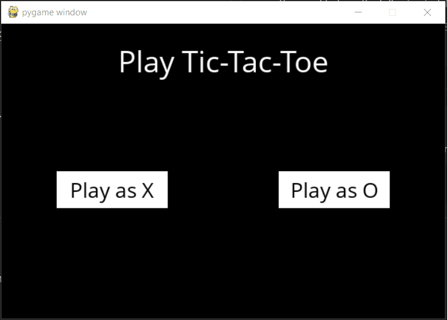

# AI TicTacToe game
This game is built using Python and a game framework called Pygame. Here you can play TicTacToe with an AI that never looses. It uses the Minimax AI algorithm.
___

# Getting Started
You need to have the following installed.
1. Download and Install [Python 3.5+](https://www.python.org/downloads)
2. Downlaod the requirements.

        pip install -r requirements.txt
    *for Linux and MacOS use pip3*
3. Run the following command in the terminal or Command Prompt.

        python runner.py
    *use python3 for Linux and MacOS*

Done.
___

## Showcasing the game
